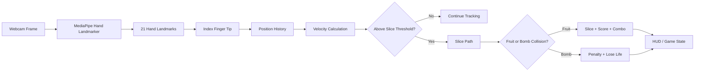

# Fruit Ninja — Real-Time Hand Tracking

[](https://github.com/alaamadii/ninja-fruite-computervision/actions/workflows/ci.yml)

A real-time Computer Vision game that turns webcam hand movement into Fruit Ninja-style slicing. The application combines MediaPipe hand landmarks, index-finger motion tracking, velocity-based gesture detection, fruit/bomb collision logic, scoring, combos, lives, and game-over state in one interactive Python application.

**Portfolio focus:** Computer Vision · real-time vision pipelines · gesture recognition · game-state engineering · automated testing · CI

## Engineering Highlights

- Detects up to two hands from a live webcam feed using MediaPipe Hand Landmarker.
- Tracks the index-finger tip across frames and calculates motion velocity in pixels/second.
- Triggers slice gestures only when hand velocity crosses a configurable threshold.
- Uses the gesture path for fruit and bomb interaction rather than treating every detected hand position as a hit.
- Implements delta-time-aware fruit physics with gravity and configurable spawn/velocity ranges.
- Separates hand tracking, gesture detection, fruit/bomb behavior, spawning, HUD, and game-state management into focused modules.
- Includes scoring, combo growth/timeout, bomb penalties, lives, missed-fruit penalties, and game-over handling.
- Runs automated correctness checks, source compilation, and core-logic tests in GitHub Actions.

## Vision-to-Gameplay Pipeline



## Implemented Gameplay

- Live camera gameplay
- 21-point MediaPipe hand landmark detection
- Two-hand support
- Index-finger slicing gestures
- Velocity-based gesture thresholding
- Fruit spawning and gravity-based physics
- Multiple fruit types with cached illustrated artwork
- Fruit collision, animated halves, and juice splashes
- Bomb obstacles and score penalties
- Score and combo system
- Lives and missed-fruit penalties
- Game-over condition
- Real-time HUD and visual hand trails
- Configurable gameplay and tracking parameters

## Tech Stack

- Python
- OpenCV
- MediaPipe Tasks / Hand Landmarker
- NumPy
- Pillow
- Pygame
- `unittest`
- Ruff
- GitHub Actions

## Project Structure

```text
ninja-fruite-computervision/
├── main.py                      # Application entry point and gameplay orchestration
├── config.py                    # Tracking, physics, scoring, and UI configuration
├── hand_landmarker.task         # MediaPipe hand-landmark model
├── requirements.txt
├── pyproject.toml               # Ruff configuration
├── game/
│   ├── bomb.py                  # Bomb behavior and rendering
│   ├── fruit.py                 # Fruit physics, rendering, and collision helpers
│   ├── fruit_spawner.py         # Fruit/bomb spawning and lifecycle
│   ├── game_engine.py           # Camera, frame timing, and display management
│   ├── game_manager.py          # Score, combo, lives, and game-over state
│   └── gesture_detector.py      # Velocity-based slicing detection
├── vision/
│   └── hand_tracker.py          # Canonical MediaPipe Hand Landmarker wrapper
├── ui/
│   └── hud.py                   # Score/lives/combo overlay
├── tests/
│   └── test_core_logic.py       # Game-state, gesture, and fruit-physics tests
└── .github/workflows/ci.yml     # Automated quality checks
```

## Getting Started

### Play in the browser (new)

The repository now includes a responsive static web game with illustrated fruit,
directional fruit halves, juice particles, combos, mouse/touch support, and
two-hand MediaPipe tracking. Browser rounds have five lives and six difficulty levels. Every 20 seconds of
active play, fruit speed increases by 15 percentage points, up to 1.75x at level 6.
Fruit waves and bombs become more frequent. Preparation, pause, and tracking loss
do not advance the level timer. Restarting resets difficulty to level 1.
Rendering uses `requestAnimationFrame`; inference
runs in a worker, throttled to 30 requests/second with one frame in flight.
Adaptive fingertip smoothing reduces jitter and resets after tracking loss.

From the repository root, run:

```bash
python -m http.server 8000 --bind 127.0.0.1
```

Open **http://localhost:8000** and choose **Enable camera & play**. The browser
requests camera permission; no microphone is requested. You can also choose
mouse/touch mode and drag to slice. Escape pauses; End game releases the camera.
Camera frames stay in the browser and are not uploaded or recorded.

For deployment, run `npm run build` (Node 22+) and publish **dist/** as a static
site. Included Vercel and Netlify settings select that directory and allow camera
access on the same origin. No backend or Python runtime is needed in production.
The build copies only browser assets and the local hand model.

Camera access requires **HTTPS** in production (localhost works for development).
Browsers remember permission choices, so a prompt is not guaranteed on every
visit. If denied, allow the camera in site settings and retry. If embedded, the
parent page must also permit the camera via its Permissions Policy and
`<iframe allow="camera">`; opening the site directly is simplest.

The initial hand tracker loads pinned MediaPipe JavaScript/WASM from jsDelivr;
fonts load from Google Fonts with local fallbacks. An internet connection is
needed for the tracker. The model is served locally as `hand_landmarker.task`.
If loading fails or the camera disconnects, mouse/touch mode remains available.

```bash
npm test
npm run build
```

Browser tests cover continuous collision detection, jitter reduction, tracking
reacquisition, mirrored/cropped camera coordinates, and separating fruit halves.
Physical-camera tracking quality should also be checked on the target devices.

The Python game also has cached fruit artwork, animated halves and juice,
shared smoothed coordinates for trails and collisions, real video timestamps,
and corrected missed-fruit accounting and object cleanup.

### Requirements

- Python 3.10+
- Webcam

### Install

```bash
git clone https://github.com/alaamadii/ninja-fruite-computervision.git
cd ninja-fruite-computervision
python -m venv .venv
```

Activate the environment:

```bash
# Windows
.venv\Scripts\activate

# macOS/Linux
source .venv/bin/activate
```

Install dependencies:

```bash
python -m pip install --upgrade pip
pip install -r requirements.txt
```

### Run

```bash
python main.py
```

Controls:

- Move your index finger quickly across a fruit to slice it.
- Avoid bombs.
- Press `Q` or `ESC` to quit.

## How Slice Detection Works

`GestureDetector` stores a short history of index-finger positions for each detected hand. It compares the oldest and newest samples in that history, calculates displacement and elapsed time, and converts them into movement velocity. A slice is emitted only when that velocity reaches the configured threshold.

This keeps the interaction tied to deliberate fast motion instead of treating a stationary fingertip over a fruit as a slice.

The main gameplay loop then uses the detected slice path to check interactions with active fruits and bombs before updating score, combo, lives, and HUD state.

## Configuration

`config.py` exposes the main tuning parameters, including:

- Resolution and target FPS
- Hand detection/tracking confidence
- Maximum number of hands
- Fruit spawn rate and radius
- Gravity and velocity ranges
- Gesture velocity threshold
- Gesture history size
- Scoring, combo bonus, bomb penalty, and initial lives

## Automated Quality Checks

The GitHub Actions workflow installs the project, runs Ruff correctness checks, compiles all Python sources, and executes the core-logic test suite.

Run the same checks locally with:

```bash
ruff check .
python -m compileall -q .
python -m unittest discover -s tests -v
```

The current tests focus on deterministic logic that can be verified without a webcam: scoring/combo behavior, lives and game-over transitions, gesture-speed thresholds, hand-history cleanup, fruit movement, slicing state, and circular point collision.

## Current Limitations

- Real-time behavior depends on webcam quality, lighting, hand visibility, and machine performance.
- Gesture thresholds are heuristic and may need tuning for different camera resolutions or users.
- Automated CI validates deterministic game logic but cannot validate webcam/MediaPipe behavior on a physical camera.
- The project currently focuses on the playable Computer Vision interaction rather than menu/audio/high-score polish.

## Possible Future Improvements

- Recorded-video integration tests for the vision pipeline
- Configurable difficulty levels
- Sound effects and menu/game-over screens
- High-score persistence
- Performance profiling and adaptive frame processing
- More advanced gesture classification beyond velocity thresholding


